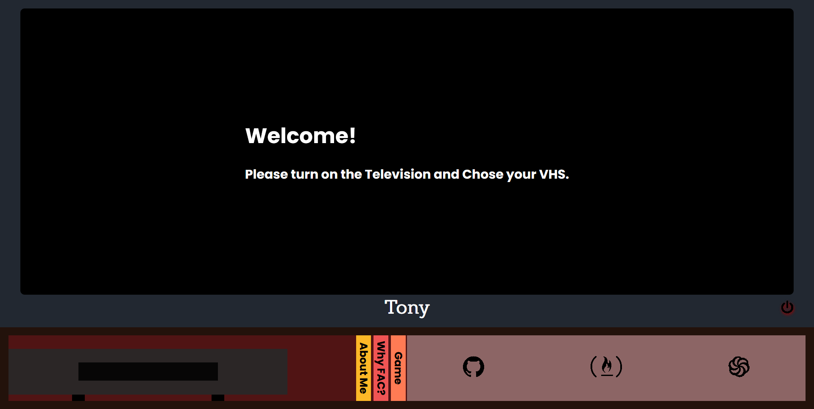

# Website to support my application to Founders and Coders 2021 spring cohort

## What is Founders & Coders?

FAC is a non-profit organisation and global developer community. They run an intensive, peer-led programming bootcamp in London which helps students from all backgrounds break into tech and make a social impact.

>

## Application prerequisites

As per January 2021, [Founders and Coders](https://www.foundersandcoders.com) application prerequisites were:

- [x] Complete recommended [freeCodeCamp](https://www.freecodecamp.org)’s curriculum courses.
- [x] Complete a list of 20 recommended katas from kyu 8 to 5 in JavaScript on [Codewars](https://www.codewars.com).
- [x] Create a website and host it on GitHub Pages.
